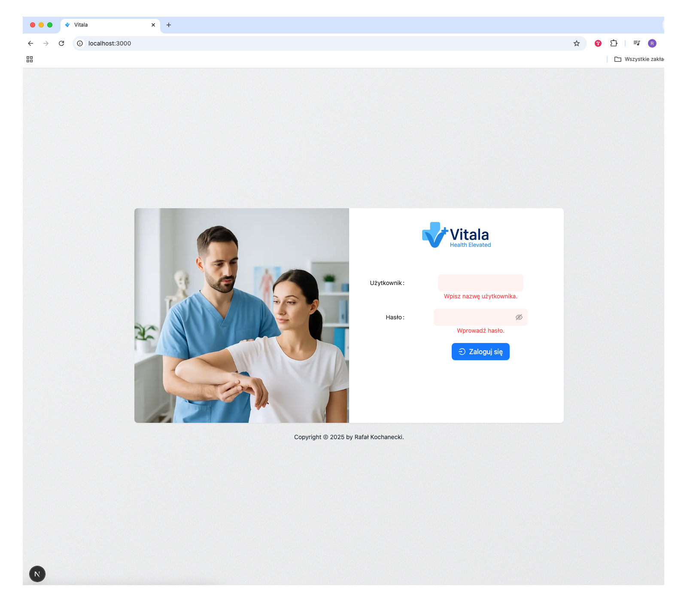

# 🧠 Rehabilitacja Frontend (Next.js)

This is the frontend of the **Rehabilitacja Module** application — handling user authentication, session scheduling, and integration with the backend API.



---

## 📦 Tech Stack

- [Next.js 14 (Pages Router + CSR)](https://nextjs.org/)
- TypeScript
- LESS
- ESLint + Prettier
- React Hook Form + Zod
- Zustand (planned)
- JWT-based authentication (planned)

---

## 🚀 Local Development

1. **Clone the repository**

```bash
git clone https://github.com/Rafalk88/rehabilitacja-frontend.git
cd rehabilitacja-frontend
```

2. Install dependencies

```bash
git clone https://github.com/Rafalk88/rehabilitacja-frontend.git
 cd rehabilitacja-frontend
```

3. Run the development server

```bash
pnpm install
```

3. Run the development server

```bash
pnpm run dev
```

## 🧪 Linting & Formatting

Run ESLint:

```bash
pnpm run lint
```

## 🗂️ Project Structure (Alpha)

```php
rehab-frontend/
├── public/               # Static assets
├── src/
│   ├── pages/            # Pages Router files
│   ├── components/       # Reusable UI components
│   ├── lib/              # Utility functions (auth, API)
│   ├── styles/           # Global Less styles
│   └── ...
├── .eslint.config.json
├── .prettierrc
└── ...
```

## 🔐 Authentication (Planned)

Login and register UI
JWT auth with secure cookie or localStorage
Route protection (middleware / HOC)
Integration with backend

## 🧾 Versioning

We follow SemVer.
This is an early alpha, versions will be tagged as 0.x.x-alpha.

See CHANGELOG.md for details.

## 📄 License

This project is for educational purposes only.
MIT-style open development (non-commercial).
