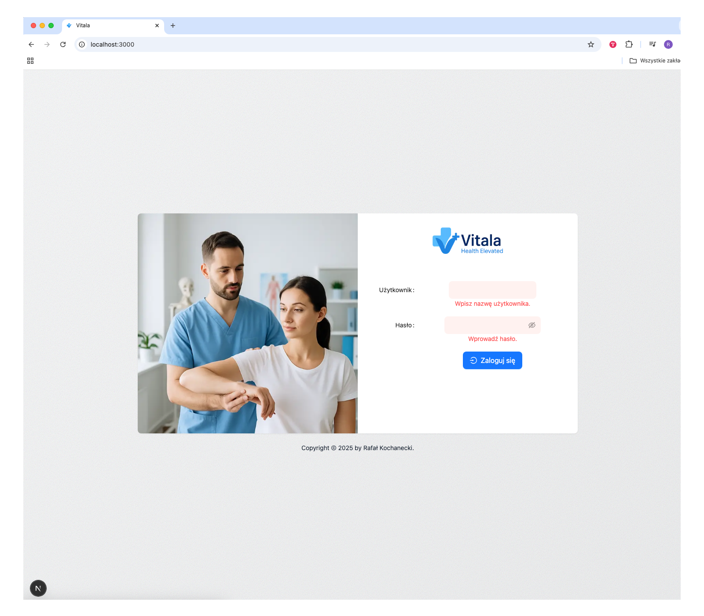
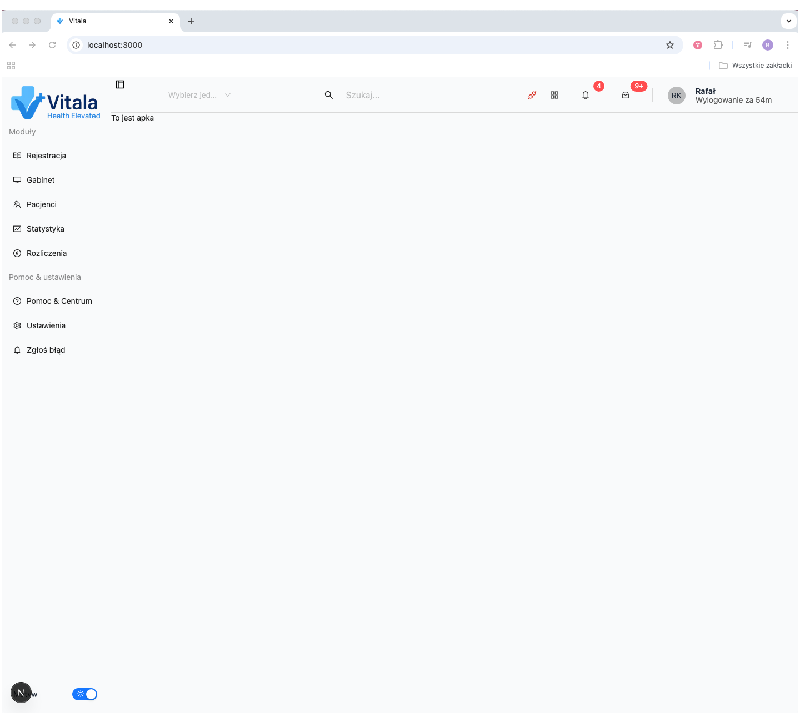

# Rehab Frontend

⚡ **Project Status: Active Development**
The codebase represents the current, stable architecture for the Rehabilitation Management System.




## 🚀 Tech Stack

- [Next.js 14 (Pages Router + CSR)](https://nextjs.org/)
- TypeScript
- LESS
- React Query
- AntD
- Axios
- ESLint + Prettier
- JWT-based authentication

## 🗂️ Project Structure (Alpha)

```bash
rehab-frontend/
├── public/               # Static assets
├── src/
│   ├── components/       # Reusable UI components
│   ├── hooks/            # Hooks logic
│   ├── lib/              # Utility functions (auth, API)
│   ├── pages/            # Pages Router files
│   ├── styles/           # Global Less styles
│   └── ...
├── .eslint.config.json
├── .prettierrc
└── ...
```

## 🛠️ Setup

0. **IMPORTANT**

The frontend won't work without backend server. It will only show /login page. For complexity go to 
[BACKEND](https://github.com/Rafalk88/rehabilitacja-backend.git)
and install server first.

1. **Clone the repository**

```bash
git clone https://github.com/Rafalk88/rehabilitacja-frontend.git
cd rehabilitacja-frontend
```

2. **Set up .env**

```bash
cp .env.example .env
```

Then fill in your values:

```bash
NEXT_PUBLIC_API_URL=you_api_url
```

3. **Install dependencies**

```bash
pnpm install
```

4. **Start the server in dev mode**

```bash
pnpm run dev
```

## 🧪 Linting & Formatting

Run ESLint:

```bash
pnpm run lint
```

## 📖 Features

- Auto logout after 15 minutes inactivity

## 📘 Documentation

- [Main documentation](https://github.com/Rafalk88/rehab-module)
- [DECISIONS.md](./DECISIONS.md)
- [CHANGELOG.md](./changelog.md)

## 📄 License

This project is for educational purposes only.
MIT
